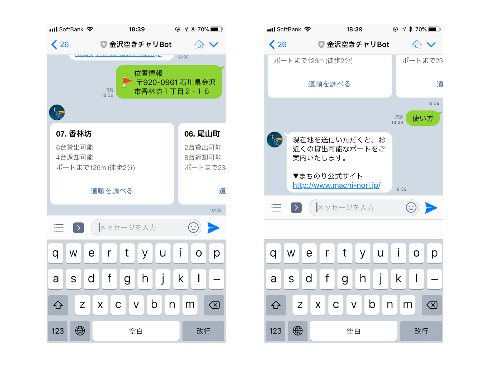
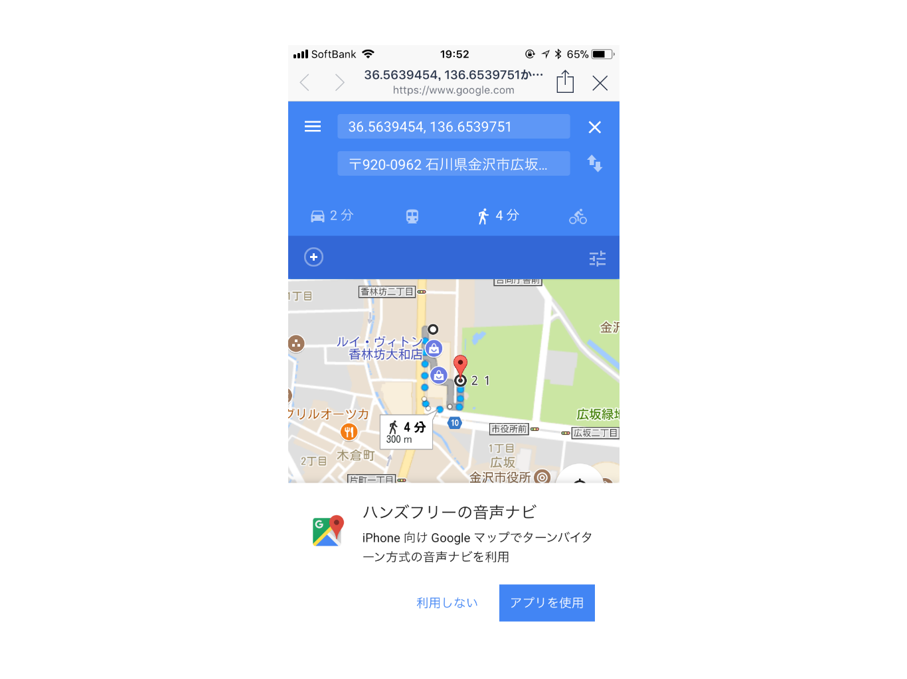
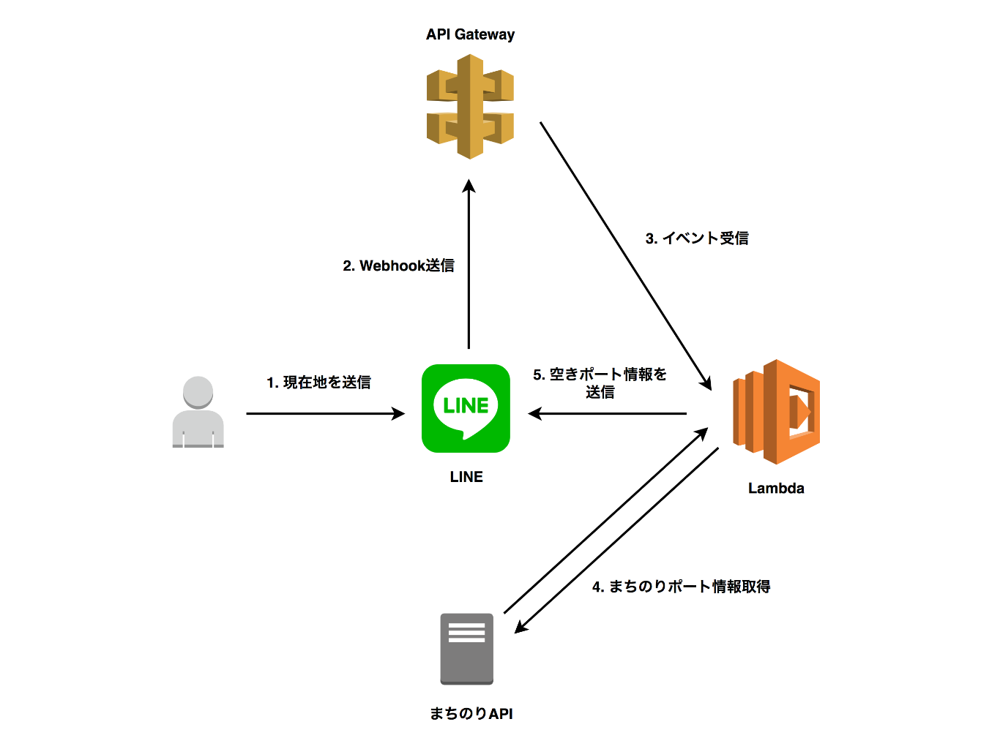

# 金沢空きチャリbot
金沢のレンタサイクル「まちのり」の貸出可能なポートを案内してくれるLINE Botです。

## 特徴
* 現在地を送ると、近くの貸し出し可能なポートを3箇所表示
* ポートまでの道順を表示

## 使い方


Botに対して現在地を送ると、貸し出し可能なポートを表示します。



道順を調べるを押すと、ポートまでの経路を表示します。

## 構成


## 開発環境構築
本サービスの開発環境を構築するためにはAWSアカウントとLINEの開発者登録が必要です。

```
$ npm install
$ npm run package
$ aws cloudformation package --template-file template.yml --s3-bucket <bucket name> --output-template .sam/packaged.yml
$ aws cloudformation deploy --template-file ./.sam/packaged.yml --stack-name <stack name> --capabilities CAPABILITY_IAM
```
リポジトリをクローンして、プロジェクトディレクトリ内で上記コマンドを実行していくと、API GatewayとLambdaを組み合わせたアプリケーションがAWS上に構築されます。

CloudFormationコンソールにて、作成したスタックの出力結果の`ApiUrl`にAPI Gatewayのエンドポイントが表示されるので、LINE BotのWebhookに登録してください。

また、LambdaのコンソールでLINE Message APIトークンを環境変数`MESSAGE_API_TOKEN`として設定してください。

## ライセンス
MIT
